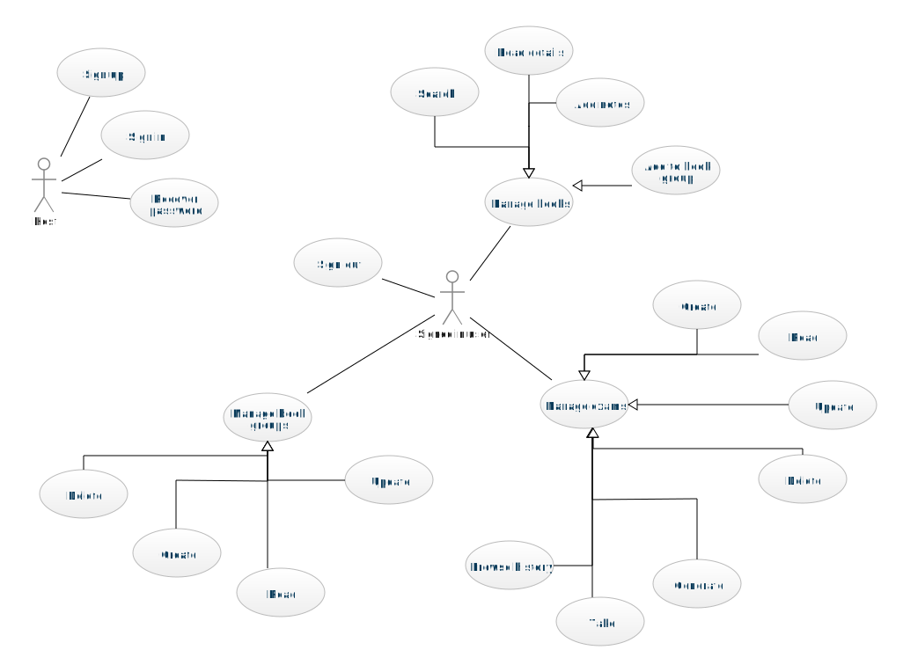

# KnizniVypisky.cz

[](./LICENSE)

- KnizniVypisky.cz is a web application that allows users to find information about books and create their own notes.
- It also allows user to group books into collections and generate or manually create tests for books in those
  collections.
- The application is mainly aimed at high school and college students.
- It uses data from Google and gets information about books from **Google Books API**.

## Table of Contents

* [Authors](#authors)
* [Technology stack](#technology-stack)
* [Features](#features)
* [Setup](#setup)
* [Usage](#usage)

## Authors

👤 **Daniil Astapenko**<br>
UID: xastapen<br>
@: <a href="mailto:xastapen@node.mendelu.cz">xastapen@node.mendelu.cz</a><br>

👤 **Petr Chatrný** <br>
UID: xchatrny<br>
@: <a href="mailto:xchatrny@mendelu.cz">xchatrny@mendelu.cz</a><br>

👤 **Martin Navrátil**<br>
UID: xnavra18<br>
@: <a href="mailto:xnavra18@node.mendelu.cz">xnavra18@node.mendelu.cz</a><br>

👤 **Lucie Pacáková**<br>
UID: xpacako1<br>
@: <a href="mailto:xpacako1@mendelu.cz">xpacako1@mendelu.cz</a><br>

## Technology stack

| Field       | Technologies                                                                                                                                                                                                                                                                                                                                                                                                                            |
|-------------|-----------------------------------------------------------------------------------------------------------------------------------------------------------------------------------------------------------------------------------------------------------------------------------------------------------------------------------------------------------------------------------------------------------------------------------------|
| Environment |                                                                                                       |
| Backend     |                                                                                                                                                                                                          |
| Frontend    |     |
| Deployment  |                                                                                                                                                                                                                         |

## Features



## Setup

### Ordinary

```bash
git clone https://username@bitbucket.org/mendelu/waf_ss2022_xastapen.git
cd waf_ss2022_xastapen

yarn install
```

### Docker

```bash
git clone https://username@bitbucket.org/mendelu/waf_ss2022_xastapen.git
cd waf_ss2022_xastapen

docker image build -t knizni-vypisky .
docker run --name knizni-vypisky -p 8080:8080 -d knizni-vypisky
```


## Usage

- `yarn run dev` - starts development Vite server
- `yarn run build` - builds the project and outputs to **./dist** directory
- `yarn run preview` - starts a local web server that serves built code from **./dist** directory (production-like
  preview)